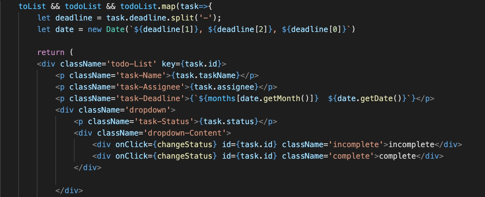
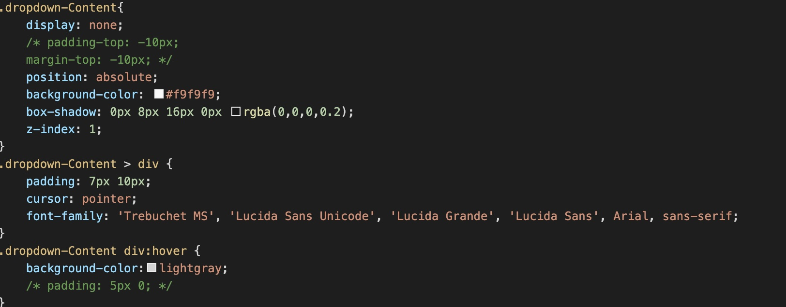
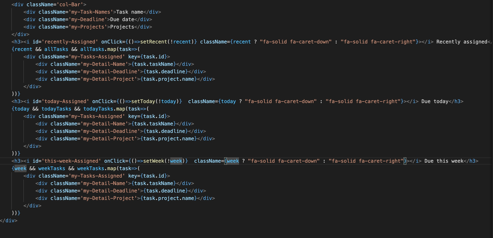
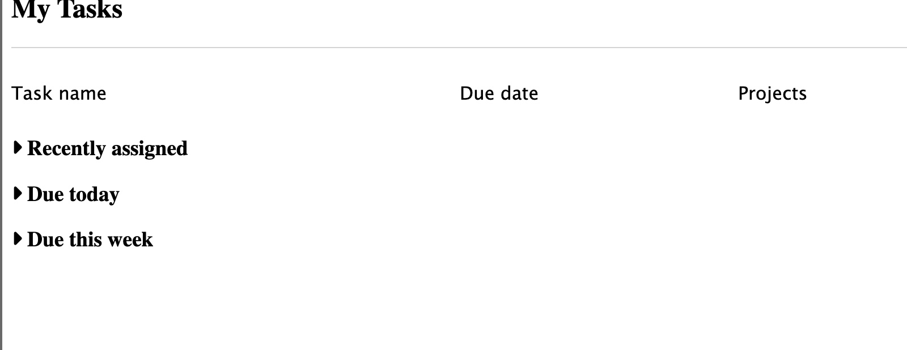
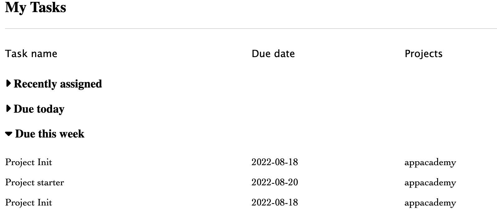

# AsanaList Readme

Welcome to the README for AsanaList! \
Live Link [Asanalist](https://captoneproject.herokuapp.com) \
AsanaList is clone of [Asana](https://asana.com) that users can use it to manage their todo lists

## Installation

1. Clone CaptoneProject repo
2. Run ```pipenv install``` to install dependencies for flask app.
3. Run ```pipenv run flask run``` to start the backend flask server.
4. Open another terminal, and ```cd``` into ```/react-app``` folder.
5. Run ```npm install``` to install dependencies for react.
6. Run ```npm start``` to start the frontend server.

## Index
- [Features](https://github.com/jxyin0513/CapstoneProject/wiki/MVP-Feature-Lists)
- [Components](https://github.com/jxyin0513/CapstoneProject/wiki/Components-Lists)
- [Schema](https://github.com/jxyin0513/CapstoneProject/wiki/DataBase-Schema)
- [Frontend Routes](https://github.com/jxyin0513/CapstoneProject/wiki/Frontend-routes)
- [API Routes](https://github.com/jxyin0513/CapstoneProject/wiki/API-routes)
- [Redux Store Tree](https://github.com/jxyin0513/CapstoneProject/wiki/State-Shape)

## App in action

### Main page

### Main page(for signed in user)

### Tasks page

### Project page


## Technologies Used
       
      


## To-dos/Future features

 - Scrum board
 - Portfolio shows progress of project
 - Timeline/Calendar
 - Workflow(how to manage tasks based on urgency, importance)
 - Dashboard

## Technical implementation details
If there's something that blocked me from the beginning, I need to figure out how to layout todo lists and done lists, how to specifically display each tasks. What I kept thinking whenever I tried to add functionalities into app is how to make it easy to use and intuitive.I have to be careful of the UI/UX side of the app.

I made dropdown box for updating status of the task was also challenging, and its design that only show dropdown when hover over. I needed to only update the status of task, so I just made another API route to update just status.



Also, I made a icon clickable to show and hide tasks in each section, and also use ternary to set its className for specific icon to display show and hide.





